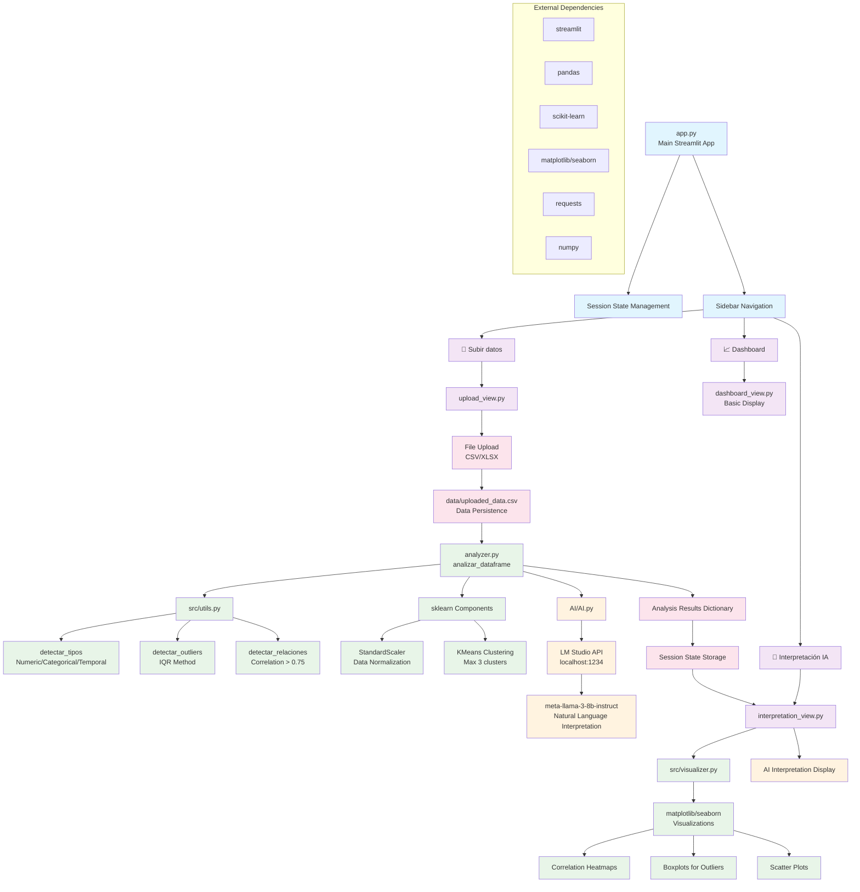

# Application Architecture Diagram

This Mermaid diagram explains the structure and data flow of the Streamlit data analysis application.

## Architecture Overview

**Application Flow:**
- Main navigation through 3 pages via sidebar
- Data upload → persistence → analysis → visualization → AI interpretation

**Key Components:**
- **Blue**: Main application and navigation
- **Purple**: View components (upload, dashboard, interpretation)
- **Green**: Analysis and visualization modules
- **Orange**: AI integration with LM Studio
- **Pink**: Data storage and session management

**Data Pipeline:**
1. CSV upload through `upload_view.py`
2. Data analysis via `analyzer.py` using utilities
3. Machine learning processing (clustering, scaling)
4. AI interpretation via local LLM
5. Results visualization and display

The diagram shows how the modular architecture separates concerns while maintaining a clear data flow from upload to final AI-powered insights.